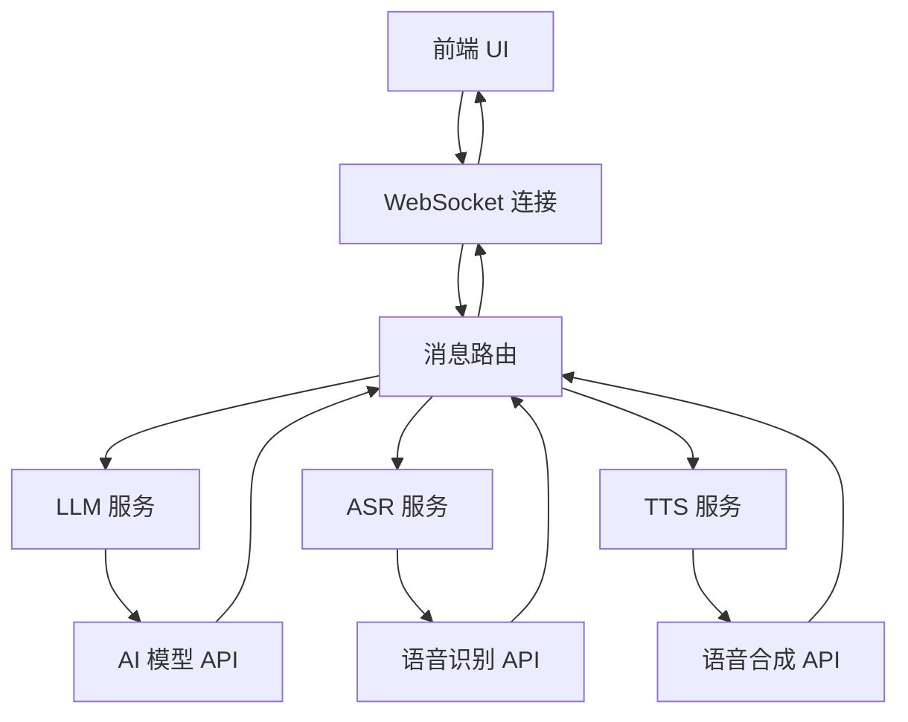

# Luna-Aster 开发指南

本指南为开发者提供详细的开发环境搭建、代码结构说明、开发流程和最佳实践。

## 📋 目录

- [开发环境搭建](#开发环境搭建)
- [项目架构](#项目架构)
- [开发流程](#开发流程)
- [代码规范](#代码规范)
- [测试指南](#测试指南)
- [调试技巧](#调试技巧)
- [性能优化](#性能优化)
- [部署指南](#部署指南)
- [贡献指南](#贡献指南)

## 🛠️ 开发环境搭建

### 必需工具

```bash
# 1. 安装 Node.js (18.0.0+)
node --version

# 2. 安装 Python (3.8+)
python --version

# 3. 安装 Git
git --version

# 4. 安装代码编辑器
# 推荐: VS Code, PyCharm, WebStorm
```

### 推荐的 VS Code 扩展

```json
{
  "recommendations": [
    "ms-python.python",
    "ms-python.black-formatter",
    "ms-python.flake8",
    "bradlc.vscode-tailwindcss",
    "esbenp.prettier-vscode",
    "ms-vscode.vscode-typescript-next",
    "ms-vscode.vscode-json",
    "redhat.vscode-yaml",
    "ms-vscode.vscode-eslint"
  ]
}
```

### 开发环境配置

#### 1. 克隆项目

```bash
git clone https://github.com/your-username/Luna-Aster.git
cd Luna-Aster
```

#### 2. 设置 Python 虚拟环境

```bash
# 创建虚拟环境
python -m venv venv

# 激活虚拟环境
source venv/bin/activate  # Linux/macOS
venv\Scripts\activate     # Windows

# 安装依赖
cd backend
pip install -r requirements.txt
pip install -r requirements-dev.txt  # 开发依赖
```

#### 3. 设置 Node.js 环境

```bash
cd frontend
npm install
npm install -g @types/node typescript  # 全局工具
```

#### 4. 配置环境变量

```bash
# 复制环境配置文件
cp backend/.env.example backend/.env

# 编辑配置文件
# 设置开发模式
DEBUG=true
LOG_LEVEL=DEBUG

# 使用测试服务（无需 API 密钥）
LLM_PROVIDER=mock
ASR_PROVIDER=mock
TTS_PROVIDER=mock
```

#### 5. 安装开发工具

```bash
# Python 开发工具
pip install black flake8 mypy pytest pytest-cov

# Node.js 开发工具
npm install -g eslint prettier typescript
```

## 🏗️ 项目架构

### 整体架构

```
Luna-Aster/
├── frontend/           # React + TypeScript 前端
├── backend/           # FastAPI + Python 后端
├── shared/           # 共享协议和类型定义
├── docs/             # 项目文档
├── tests/            # 测试文件
└── scripts/          # 构建和部署脚本
```

### 前端架构

```
frontend/
├── src/
│   ├── components/    # React 组件
│   │   ├── ChatInterface/
│   │   ├── ControlPanel/
│   │   └── StatusBar/
│   ├── contexts/      # React Context
│   ├── hooks/         # 自定义 Hooks
│   ├── types/         # TypeScript 类型定义
│   ├── utils/         # 工具函数
│   ├── styles/        # 样式文件
│   └── App.tsx        # 主应用组件
├── public/            # 静态资源
└── package.json       # 依赖配置
```

### 后端架构

```
backend/
├── main.py           # FastAPI 应用入口
├── config/           # 配置管理
├── services/         # 业务服务
│   ├── llm/         # 大语言模型服务
│   ├── asr/         # 语音识别服务
│   └── tts/         # 语音合成服务
├── websocket/        # WebSocket 管理
├── models/           # 数据模型
├── utils/            # 工具函数
└── requirements.txt  # Python 依赖
```

### 数据流架构



## 🔄 开发流程

### 1. 功能开发流程

```bash
# 1. 创建功能分支
git checkout -b feature/new-feature

# 2. 开发功能
# 编写代码...

# 3. 运行测试
npm test                    # 前端测试
pytest                     # 后端测试

# 4. 代码格式化
npm run format             # 前端格式化
black backend/             # 后端格式化

# 5. 代码检查
npm run lint               # 前端检查
flake8 backend/            # 后端检查

# 6. 提交代码
git add .
git commit -m "feat: add new feature"

# 7. 推送分支
git push origin feature/new-feature

# 8. 创建 Pull Request
```

### 2. 热重载开发

#### 前端热重载

```bash
cd frontend
npm run dev
# 访问 http://localhost:5173
# 修改代码后自动刷新
```

#### 后端热重载

```bash
cd backend
# 安装 uvicorn[standard]
pip install uvicorn[standard]

# 启动开发服务器
uvicorn main:app --reload --host 0.0.0.0 --port 8000
# 修改代码后自动重启
```

### 3. 调试配置

#### VS Code 调试配置

```json
// .vscode/launch.json
{
  "version": "0.2.0",
  "configurations": [
    {
      "name": "Python: FastAPI",
      "type": "python",
      "request": "launch",
      "program": "${workspaceFolder}/backend/main.py",
      "console": "integratedTerminal",
      "env": {
        "DEBUG": "true"
      }
    },
    {
      "name": "Node: React App",
      "type": "node",
      "request": "launch",
      "program": "${workspaceFolder}/frontend/node_modules/.bin/vite",
      "args": ["dev"],
      "cwd": "${workspaceFolder}/frontend"
    }
  ]
}
```

## 📝 代码规范

### Python 代码规范

#### 1. 代码格式化

```bash
# 使用 Black 格式化
black backend/ --line-length 88

# 使用 isort 排序导入
isort backend/ --profile black
```

#### 2. 代码检查

```bash
# 使用 flake8 检查
flake8 backend/ --max-line-length 88 --extend-ignore E203,W503

# 使用 mypy 类型检查
mypy backend/ --ignore-missing-imports
```

#### 3. 代码示例

```python
"""模块文档字符串."""

from typing import Optional, List, Dict, Any
import asyncio
from fastapi import FastAPI, WebSocket
from pydantic import BaseModel, Field


class MessageModel(BaseModel):
    """消息模型."""
    
    type: str = Field(..., description="消息类型")
    content: str = Field(..., description="消息内容")
    timestamp: float = Field(..., description="时间戳")
    client_id: Optional[str] = Field(None, description="客户端ID")


async def process_message(
    message: MessageModel,
    websocket: WebSocket
) -> Dict[str, Any]:
    """
    处理消息.
    
    Args:
        message: 输入消息
        websocket: WebSocket 连接
        
    Returns:
        处理结果
        
    Raises:
        ValueError: 消息格式错误
    """
    try:
        # 处理逻辑
        result = await some_async_operation(message)
        return {"status": "success", "data": result}
    except Exception as e:
        logger.error(f"处理消息失败: {e}")
        raise ValueError(f"消息处理错误: {e}")


class ServiceManager:
    """服务管理器."""
    
    def __init__(self, config: Dict[str, Any]) -> None:
        """初始化服务管理器."""
        self.config = config
        self._services: Dict[str, Any] = {}
    
    async def start_service(self, name: str) -> None:
        """启动服务."""
        if name in self._services:
            raise ValueError(f"服务 {name} 已存在")
        
        # 启动逻辑
        self._services[name] = await create_service(name, self.config)
```

### TypeScript 代码规范

#### 1. 代码格式化

```bash
# 使用 Prettier 格式化
npx prettier --write "src/**/*.{ts,tsx,js,jsx}"

# 使用 ESLint 检查
npx eslint "src/**/*.{ts,tsx}" --fix
```

#### 2. 配置文件

```json
// .eslintrc.json
{
  "extends": [
    "@typescript-eslint/recommended",
    "plugin:react/recommended",
    "plugin:react-hooks/recommended"
  ],
  "rules": {
    "@typescript-eslint/explicit-function-return-type": "error",
    "@typescript-eslint/no-unused-vars": "error",
    "react/prop-types": "off"
  }
}
```

#### 3. 代码示例

```typescript
/**
 * 消息接口定义
 */
export interface Message {
  type: MessageType;
  content: string;
  timestamp: number;
  clientId?: string;
}

/**
 * WebSocket 管理器
 */
export class WebSocketManager {
  private ws: WebSocket | null = null;
  private reconnectAttempts = 0;
  private readonly maxReconnectAttempts = 5;

  constructor(private readonly config: WebSocketConfig) {}

  /**
   * 连接 WebSocket
   */
  public async connect(): Promise<void> {
    try {
      this.ws = new WebSocket(this.config.url);
      this.setupEventListeners();
      await this.waitForConnection();
    } catch (error) {
      console.error('WebSocket 连接失败:', error);
      throw new Error(`连接失败: ${error.message}`);
    }
  }

  /**
   * 发送消息
   */
  public sendMessage(message: Message): void {
    if (!this.isConnected()) {
      throw new Error('WebSocket 未连接');
    }

    const serializedMessage = JSON.stringify(message);
    this.ws!.send(serializedMessage);
  }

  private setupEventListeners(): void {
    if (!this.ws) return;

    this.ws.onopen = this.handleOpen.bind(this);
    this.ws.onmessage = this.handleMessage.bind(this);
    this.ws.onclose = this.handleClose.bind(this);
    this.ws.onerror = this.handleError.bind(this);
  }

  private handleOpen(event: Event): void {
    console.log('WebSocket 连接已建立');
    this.reconnectAttempts = 0;
  }
}

/**
 * React 组件示例
 */
interface ChatInterfaceProps {
  messages: Message[];
  onSendMessage: (content: string) => void;
}

export const ChatInterface: React.FC<ChatInterfaceProps> = ({
  messages,
  onSendMessage,
}) => {
  const [inputValue, setInputValue] = useState<string>('');

  const handleSubmit = useCallback((e: React.FormEvent) => {
    e.preventDefault();
    if (inputValue.trim()) {
      onSendMessage(inputValue.trim());
      setInputValue('');
    }
  }, [inputValue, onSendMessage]);

  return (
    <div className="chat-interface">
      <div className="messages">
        {messages.map((message, index) => (
          <MessageComponent key={index} message={message} />
        ))}
      </div>
      <form onSubmit={handleSubmit}>
        <input
          type="text"
          value={inputValue}
          onChange={(e) => setInputValue(e.target.value)}
          placeholder="输入消息..."
        />
        <button type="submit">发送</button>
      </form>
    </div>
  );
};
```

## 🧪 测试指南

### 前端测试

#### 1. 单元测试

```typescript
// src/utils/__tests__/audioUtils.test.ts
import { describe, it, expect, vi } from 'vitest';
import { AudioRecorder } from '../audioUtils';

describe('AudioRecorder', () => {
  it('应该正确初始化', () => {
    const recorder = new AudioRecorder();
    expect(recorder).toBeDefined();
  });

  it('应该能够开始录音', async () => {
    // Mock MediaDevices
    const mockGetUserMedia = vi.fn().mockResolvedValue({
      getTracks: () => [{ stop: vi.fn() }]
    });
    
    Object.defineProperty(navigator, 'mediaDevices', {
      value: { getUserMedia: mockGetUserMedia },
      writable: true
    });

    const recorder = new AudioRecorder();
    await recorder.startRecording();
    
    expect(mockGetUserMedia).toHaveBeenCalledWith({ audio: true });
  });
});
```

#### 2. 组件测试

```typescript
// src/components/__tests__/ChatInterface.test.tsx
import { render, screen, fireEvent } from '@testing-library/react';
import { ChatInterface } from '../ChatInterface';

describe('ChatInterface', () => {
  const mockMessages = [
    { type: 'user', content: '你好', timestamp: Date.now() }
  ];

  it('应该渲染消息列表', () => {
    render(
      <ChatInterface 
        messages={mockMessages} 
        onSendMessage={vi.fn()} 
      />
    );
    
    expect(screen.getByText('你好')).toBeInTheDocument();
  });

  it('应该能够发送消息', () => {
    const mockSendMessage = vi.fn();
    render(
      <ChatInterface 
        messages={[]} 
        onSendMessage={mockSendMessage} 
      />
    );
    
    const input = screen.getByPlaceholderText('输入消息...');
    const button = screen.getByText('发送');
    
    fireEvent.change(input, { target: { value: '测试消息' } });
    fireEvent.click(button);
    
    expect(mockSendMessage).toHaveBeenCalledWith('测试消息');
  });
});
```

#### 3. 运行测试

```bash
cd frontend

# 运行所有测试
npm test

# 运行特定测试
npm test -- AudioRecorder

# 生成覆盖率报告
npm run test:coverage

# 监听模式
npm run test:watch
```

### 后端测试

#### 1. 单元测试

```python
# tests/test_services.py
import pytest
from unittest.mock import Mock, AsyncMock
from backend.services.llm.openai_service import OpenAIService


@pytest.fixture
def openai_service():
    """创建 OpenAI 服务实例."""
    config = {
        "api_key": "test-key",
        "model": "gpt-3.5-turbo",
        "max_tokens": 100
    }
    return OpenAIService(config)


@pytest.mark.asyncio
async def test_generate_response(openai_service):
    """测试生成响应."""
    # Mock OpenAI API 响应
    mock_response = {
        "choices": [
            {"message": {"content": "测试响应"}}
        ]
    }
    
    openai_service.client.chat.completions.create = AsyncMock(
        return_value=mock_response
    )
    
    response = await openai_service.generate_response("测试消息")
    assert response == "测试响应"


def test_validate_config():
    """测试配置验证."""
    with pytest.raises(ValueError):
        OpenAIService({})  # 缺少必需配置
```

#### 2. 集成测试

```python
# tests/test_websocket.py
import pytest
from fastapi.testclient import TestClient
from backend.main import app


@pytest.fixture
def client():
    """创建测试客户端."""
    return TestClient(app)


def test_websocket_connection(client):
    """测试 WebSocket 连接."""
    with client.websocket_connect("/ws") as websocket:
        # 发送连接消息
        websocket.send_json({
            "type": "CONNECTION_ESTABLISHED",
            "content": "",
            "timestamp": 1234567890,
            "client_id": "test-client"
        })
        
        # 接收响应
        data = websocket.receive_json()
        assert data["type"] == "CONNECTION_ESTABLISHED"


def test_chat_message(client):
    """测试聊天消息."""
    with client.websocket_connect("/ws") as websocket:
        # 发送聊天消息
        websocket.send_json({
            "type": "CHAT",
            "content": "你好",
            "timestamp": 1234567890,
            "client_id": "test-client"
        })
        
        # 接收 LLM 响应
        data = websocket.receive_json()
        assert data["type"] == "LLM_RESPONSE"
        assert "content" in data
```

#### 3. 运行测试

```bash
cd backend

# 运行所有测试
pytest

# 运行特定测试
pytest tests/test_services.py

# 生成覆盖率报告
pytest --cov=backend --cov-report=html

# 并行运行测试
pytest -n auto
```

## 🐛 调试技巧

### 前端调试

#### 1. 浏览器开发者工具

```typescript
// 在代码中添加断点
debugger;

// 使用 console 调试
console.log('变量值:', variable);
console.table(arrayData);
console.group('调试组');
console.log('组内信息');
console.groupEnd();

// 性能监控
console.time('操作耗时');
// 执行操作
console.timeEnd('操作耗时');
```

#### 2. React DevTools

```bash
# 安装 React DevTools 浏览器扩展
# Chrome: https://chrome.google.com/webstore/detail/react-developer-tools/
# Firefox: https://addons.mozilla.org/en-US/firefox/addon/react-devtools/
```

#### 3. WebSocket 调试

```typescript
// WebSocket 连接监控
const originalWebSocket = window.WebSocket;
window.WebSocket = function(url, protocols) {
  console.log('WebSocket 连接:', url);
  const ws = new originalWebSocket(url, protocols);
  
  ws.addEventListener('open', (e) => console.log('WebSocket 打开:', e));
  ws.addEventListener('message', (e) => console.log('WebSocket 消息:', e.data));
  ws.addEventListener('close', (e) => console.log('WebSocket 关闭:', e));
  ws.addEventListener('error', (e) => console.log('WebSocket 错误:', e));
  
  return ws;
};
```

### 后端调试

#### 1. 日志调试

```python
import logging

# 配置日志
logging.basicConfig(
    level=logging.DEBUG,
    format='%(asctime)s - %(name)s - %(levelname)s - %(message)s'
)

logger = logging.getLogger(__name__)

# 使用日志
logger.debug("调试信息")
logger.info("一般信息")
logger.warning("警告信息")
logger.error("错误信息")
logger.exception("异常信息")  # 自动包含堆栈跟踪
```

#### 2. 断点调试

```python
# 使用 pdb 调试器
import pdb

def problematic_function():
    x = 10
    y = 20
    pdb.set_trace()  # 设置断点
    result = x + y
    return result

# 或使用 breakpoint() (Python 3.7+)
def another_function():
    breakpoint()  # 设置断点
    # 代码逻辑
```

#### 3. 异步调试

```python
import asyncio
import logging

# 启用 asyncio 调试模式
asyncio.get_event_loop().set_debug(True)

# 记录异步操作
async def debug_async_function():
    logger.info("开始异步操作")
    try:
        result = await some_async_operation()
        logger.info(f"异步操作完成: {result}")
        return result
    except Exception as e:
        logger.exception(f"异步操作失败: {e}")
        raise
```

## ⚡ 性能优化

### 前端性能优化

#### 1. 代码分割

```typescript
// 使用 React.lazy 进行代码分割
import { lazy, Suspense } from 'react';

const ChatInterface = lazy(() => import('./components/ChatInterface'));
const ControlPanel = lazy(() => import('./components/ControlPanel'));

function App() {
  return (
    <Suspense fallback={<div>加载中...</div>}>
      <ChatInterface />
      <ControlPanel />
    </Suspense>
  );
}
```

#### 2. 内存优化

```typescript
// 使用 useMemo 缓存计算结果
const expensiveValue = useMemo(() => {
  return computeExpensiveValue(data);
}, [data]);

// 使用 useCallback 缓存函数
const handleClick = useCallback((id: string) => {
  onItemClick(id);
}, [onItemClick]);

// 清理定时器和事件监听器
useEffect(() => {
  const timer = setInterval(() => {
    // 定时任务
  }, 1000);

  return () => clearInterval(timer);
}, []);
```

#### 3. 网络优化

```typescript
// 使用 AbortController 取消请求
const controller = new AbortController();

fetch('/api/data', {
  signal: controller.signal
}).then(response => {
  // 处理响应
}).catch(error => {
  if (error.name === 'AbortError') {
    console.log('请求被取消');
  }
});

// 在组件卸载时取消请求
useEffect(() => {
  return () => controller.abort();
}, []);
```

### 后端性能优化

#### 1. 异步优化

```python
import asyncio
from concurrent.futures import ThreadPoolExecutor

# 使用线程池处理 CPU 密集型任务
executor = ThreadPoolExecutor(max_workers=4)

async def cpu_intensive_task(data):
    loop = asyncio.get_event_loop()
    result = await loop.run_in_executor(executor, process_data, data)
    return result

# 批量处理
async def batch_process(items):
    tasks = [process_item(item) for item in items]
    results = await asyncio.gather(*tasks, return_exceptions=True)
    return results
```

#### 2. 内存优化

```python
import gc
from functools import lru_cache

# 使用 LRU 缓存
@lru_cache(maxsize=128)
def expensive_function(param):
    # 昂贵的计算
    return result

# 定期清理内存
async def cleanup_memory():
    while True:
        await asyncio.sleep(300)  # 5分钟
        gc.collect()
```

#### 3. 数据库优化

```python
from sqlalchemy import select
from sqlalchemy.orm import selectinload

# 使用预加载避免 N+1 查询
async def get_users_with_posts():
    stmt = select(User).options(selectinload(User.posts))
    result = await session.execute(stmt)
    return result.scalars().all()

# 使用连接池
from sqlalchemy.pool import QueuePool

engine = create_async_engine(
    DATABASE_URL,
    poolclass=QueuePool,
    pool_size=20,
    max_overflow=30
)
```

## 🚀 部署指南

### 开发环境部署

```bash
# 使用 Docker Compose
docker-compose -f docker-compose.dev.yml up -d

# 或手动启动
cd backend && python main.py &
cd frontend && npm run dev &
```

### 生产环境部署

#### 1. 前端构建

```bash
cd frontend
npm run build

# 使用 Nginx 部署
sudo cp -r dist/* /var/www/html/
```

#### 2. 后端部署

```bash
cd backend

# 使用 Gunicorn
pip install gunicorn
gunicorn main:app -w 4 -k uvicorn.workers.UvicornWorker

# 使用 Docker
docker build -t luna-aster-backend .
docker run -p 8000:8000 luna-aster-backend
```

#### 3. 反向代理配置

```nginx
# /etc/nginx/sites-available/luna-aster
server {
    listen 80;
    server_name your-domain.com;

    location / {
        root /var/www/html;
        try_files $uri $uri/ /index.html;
    }

    location /api/ {
        proxy_pass http://localhost:8000/;
        proxy_set_header Host $host;
        proxy_set_header X-Real-IP $remote_addr;
    }

    location /ws {
        proxy_pass http://localhost:8000/ws;
        proxy_http_version 1.1;
        proxy_set_header Upgrade $http_upgrade;
        proxy_set_header Connection "upgrade";
    }
}
```

## 🤝 贡献指南

### 1. 提交规范

使用 [Conventional Commits](https://www.conventionalcommits.org/) 规范：

```bash
# 功能添加
git commit -m "feat: 添加语音识别功能"

# 问题修复
git commit -m "fix: 修复 WebSocket 连接问题"

# 文档更新
git commit -m "docs: 更新 API 文档"

# 样式调整
git commit -m "style: 调整代码格式"

# 重构
git commit -m "refactor: 重构消息处理逻辑"

# 测试
git commit -m "test: 添加单元测试"

# 构建
git commit -m "build: 更新依赖版本"
```

### 2. Pull Request 流程

```bash
# 1. Fork 项目
# 2. 创建功能分支
git checkout -b feature/amazing-feature

# 3. 提交更改
git commit -m "feat: 添加惊人的功能"

# 4. 推送到分支
git push origin feature/amazing-feature

# 5. 创建 Pull Request
```

### 3. 代码审查清单

- [ ] 代码符合项目规范
- [ ] 添加了必要的测试
- [ ] 测试全部通过
- [ ] 文档已更新
- [ ] 没有引入安全漏洞
- [ ] 性能没有明显下降
- [ ] 向后兼容

### 4. 发布流程

```bash
# 1. 更新版本号
npm version patch  # 或 minor, major

# 2. 生成变更日志
npm run changelog

# 3. 创建发布标签
git tag -a v1.0.0 -m "Release version 1.0.0"

# 4. 推送标签
git push origin v1.0.0

# 5. 创建 GitHub Release
```

---

希望这个开发指南能帮助您更好地参与 Luna-Aster 项目的开发！🚀✨